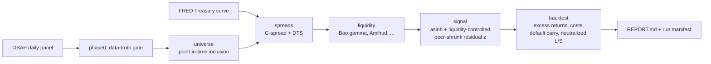

# credit-rv-toolkit

A cross-sectional **credit relative-value engine** for US corporate bonds. It fits a fair-value
spread curve across a curated universe, flags idiosyncratic cheap/rich names as standardized
residuals, and then puts that signal through a deliberately demanding backtest — net of transaction
costs, neutral to rates and credit beta, with defaulted names carried through at recovery, and
tested for liquidity-premium and impending-default contamination.

The backtest is the centerpiece, not the screen. The guiding question is not whether the signal
*correlates* with future returns, but whether trading it would actually have made money.

## Headline result

The relative-value signal has strong, persistent predictive content on realised excess returns
(rank IC ≈ 0.14–0.17 across 1–12 month horizons, Newey–West *t* up to 13), and the edge is robust to
both defaults and liquidity. Yet the duration-, DTS-, and sector-neutral long-short is **not
profitable net of realistic credit transaction costs at any turnover** — gross +1.5%/yr is overcome
by a ~2.3%/yr cost drag. The project's value is the clean separation of two questions a cheap/rich
screen usually conflates: *is there signal?* (yes) and *is it tradeable?* (no, costs dominate). Full
writeup in **[docs/REPORT.md](docs/REPORT.md)**.

## Pipeline



Each stage reads and writes versioned parquet in `data/interim/`, and the whole thing is
reproducible from one command.

## Quickstart

```bash
python -m venv .venv && source .venv/bin/activate
pip install -e ".[dev]"

# 1. Download the OBAP panel into data/raw/ and set paths.obap_panel in configs/base.yaml
# 2. Verify the data (writes docs/phase0-findings.md):
crv phase0 --config configs/base.yaml
# 3. Run everything end-to-end (writes docs/REPORT.md + reports/run_manifest.json):
make all                       # ~2 min;  add the ML comparison with:  crv all --with-gbm
```

Individual stages are also exposed: `crv fred | universe | spreads | liquidity | signal | phase3a |
phase3b | report`. See `crv --help`.

## How it works

- **Universe** — rebuilt at each month-end from panel-derivable rules (issue-size floor, trade
  frequency, maturity band), so it is point-in-time and survivorship-safe.
- **Fair value** — spread modelled on term, sector, and liquidity (Bao–Pan–Wang gamma, Amihud, trade
  frequency, age, size) in `asinh` space, so the residual is liquidity-neutral by construction.
  Empirical-Bayes shrinkage pulls each issuer's curve toward its sector peers. Three engines share a
  common interface — the cross-sectional peer-shrunk model and walk-forward ridge / gradient-boosted
  baselines — so "does ML beat linear?" is answered apples-to-apples (it does not, materially).
- **Backtest** — realised excess returns (carry − duration×Δspread − default loss), transaction costs
  from measured bid/ask, overlapping (Jegadeesh–Titman) duration/DTS/sector-neutral portfolios,
  Newey–West errors, a net-of-cost turnover frontier, and contamination tests.

## Data sources (all free)

- **Open Source Bond Asset Pricing** ([openbondassetpricing.com](https://openbondassetpricing.com)) —
  cleaned daily prices, yields, spreads, duration, bid/ask, volume.
- **FRED** — Treasury constant-maturity curve and SOFR (keyless download).
- **Hand-collected CSV** — ratings, call schedules, and seniority for the curated universe; see below.

## Repository layout

```
src/crv/
  config.py          typed, YAML-driven configuration
  ingest/            OBAP loader + Phase-0 inventory, FRED, reference CSV
  universe.py        point-in-time inclusion engine
  spreads/           G-spread, DTS, curve interpolation
  liquidity/         Bao gamma, Amihud, control-feature assembly
  fairvalue/         asinh transform, features, EB shrinkage, linear + GBM models
  backtest/          windows, returns, costs, defaults, portfolio, performance, contamination, IC
  report/            figures, per-phase summaries, consolidated REPORT.md
  cli.py             `crv` entry point
docs/                PLAN.md, phase0-gate.md, per-phase *-results.md, REPORT.md
configs/             base.yaml (frozen by the Phase-0 findings)
tests/               unit + golden-path tests
```

## Activating the curated universe (optional)

v1 runs on a candidate pool from panel-derivable rules. To enforce the strictly bullet,
rating-screened, seniority-aware universe, fill in the hand-collected reference — the pipeline picks
it up as a drop-in, no code changes:

1. Copy `data/reference/ratings_calls_template.csv` to `data/reference/ratings_calls.csv` and
   populate one (point-in-time) row per bond.
2. Set `universe.max_rating_num` in `configs/base.yaml` to your distressed cutoff.
3. Re-run `make all`. Bullet-only / rating-tier / seniority filters activate automatically.

## Reproducibility

`reports/run_manifest.json` records the config, the OBAP panel SHA-256, the git commit, and the seed
for every full run. `make all` regenerates all artifacts from scratch.
